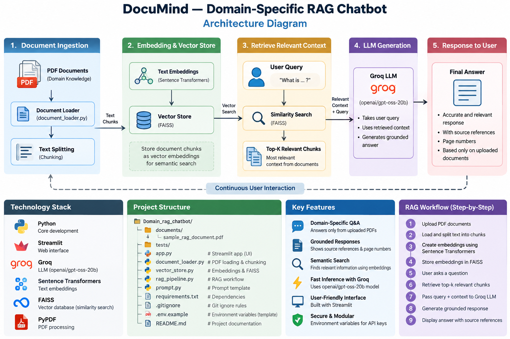

# 📚 DocuMind — Domain-Specific RAG Chatbot

A document question-answering chatbot that uses Retrieval-Augmented Generation (RAG) to answer questions from uploaded PDF documents.

The system extracts text from PDF files, splits the content into smaller chunks, converts the chunks into embeddings, stores them in a FAISS vector database, retrieves the most relevant information for a user's question, and generates a grounded answer using a Groq-hosted Large Language Model.

---

## 🚀 Project Overview

DocuMind is designed to provide reliable question answering over user-provided PDF documents.

Instead of answering questions using general knowledge, the chatbot first searches the uploaded documents for relevant information and then uses the retrieved content as context for answer generation.

This helps reduce unsupported or hallucinated answers and allows the application to provide source document and page references.

---
## 🏗️ System Architecture

The following diagram illustrates the complete workflow of the DocuMind
Domain-Specific RAG Chatbot, from PDF ingestion and text chunking to
semantic retrieval, LLM-based answer generation, and source references.



## 🎯 Objectives

The main objectives of this project are:

- Build a domain-specific PDF question-answering chatbot.
- Extract text from uploaded PDF documents.
- Split documents into manageable text chunks.
- Generate semantic embeddings for document chunks.
- Store embeddings in a FAISS vector database.
- Retrieve relevant document chunks for user questions.
- Generate grounded answers using an LLM.
- Display source document and page information.
- Refuse to invent information when the answer is not available.
- Provide an easy-to-use Streamlit web interface.

---

## 🧠 How the RAG System Works

The application follows the following workflow:

```text
                PDF Documents
                      │
                      ▼
              Text Extraction
                      │
                      ▼
                  Chunking
                      │
                      ▼
              Text Embeddings
                      │
                      ▼
                FAISS Index
                      │
                      │
                User Question
                      │
                      ▼
             Query Embedding
                      │
                      ▼
          Similarity Search
                      │
                      ▼
          Relevant Text Chunks
                      │
                      ▼
                 Groq LLM
                      │
                      ▼
             Grounded Answer
                      │
                      ▼
              Source + Page

